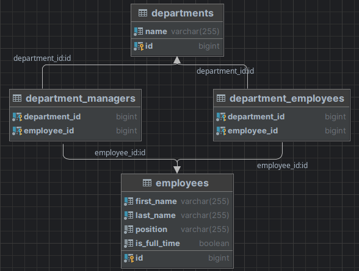
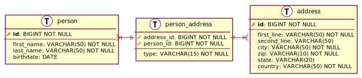

#  param-service suplement

<a href="https://www.legosoft.com.mx"></a>
Supplement in how to use Relational database interface.

The `param-service` is a good and simple example in how to use different stack to READ, UPDATE or DELETE
data from a nay relational database like Postgres (it can be applied to MySQL, MSSQL Server or other
Relational database manufacture)


note: This supplements presents two stack to be used.

## Imperative stack

This is the most common and mature approach that is 100% JPA approach using `Hibernate` as most common 
implementation. 

Other frameworks like Spring Data and `QueryDSL` also born using this imperative stack, before the reactive stack
`R2DBC`. Some developers think that the `R2DBC` is not ready for production environments.

### Introduction:

- `param` version 1.x and `param-service`version 2.x are a good examples in how to use imperative stack with `QueryDsl`
(Java for `param` and `Kotlin`form `param-service`). See code for  both complete examples.
- More microservice for the AI Legorreta marketplace that have a more complex Data model will use this stack since
the reactive stack `R2DBC` still has some problems for complex Data models.
- It is the oldest a more mature stack in comparition qith the reactive stack. That it supports 100% JPA specifications 
like relationship `OneToOne`, `OneToMany`, `ManyToMany`, `LAZY` loading, etc. Its implementation is `Hibernate` is 
one of the most used framework.

### Framework dependencies

The microservice `param` are shown in `maven` and for `param-service` are shown in `Koltin` gradle.

*__Dependencies:__*

- Driver dependencies for Spring Data are:

```
    <dependency>
       <groupId>org.springframework.boot</groupId>
       <artifactId>spring-boot-starter-data-jpa</artifactId>
    </dependency>
    <dependency>
        <groupId>org.springframework.boot</groupId>
        <artifactId>spring-boot-starter-validation</artifactId>
    </dependency>
```

And for `Kotlin` gradle:

```
	implementation("org.springframework.boot:spring-boot-starter-data-jpa")
	implementation("org.springframework.boot:spring-boot-starter-validation")
```
- The `QueryDSL` for JPA dependencies are (below this document there is an example in how to have `QueryDsl` using 
`Kotlin`and `Gradle`:
```
    <dependency>
       <groupId>com.querydsl</groupId>
       <artifactId>querydsl-core</artifactId>
       <version>${querydsl.version}</version>
    </dependency>
       <dependency>
       <groupId>com.querydsl</groupId>
       <artifactId>querydsl-jpa</artifactId>
       <version>${querydsl.version}</version>
       <classifier>jakarta</classifier>
    </dependency>
    <!-- Even and error is sent error: Annotation processor 'com.mysema.query.apt.jpa.JPAAnnotationProcessor' not found
         if we include de <classifier> tag to jpa the Q classes are generated in annotations director
    -->
    <dependency>
       <groupId>com.querydsl</groupId>
       <artifactId>querydsl-apt</artifactId>
       <version>${querydsl.version}</version>
       <classifier>jakarta</classifier>
    </dependency>
```
And for `Kotlin` gradle:
```
	implementation("com.querydsl:querydsl-jpa:${property("queryDslVersion")}:jakarta")
	kapt("com.querydsl:querydsl-apt:${property("queryDslVersion")}:jakarta")
```
- Postgres' dependency (for MySQL, MSSQLServer or other relational database use a different dependency)
```
    <dependency>
       <groupId>org.postgresql</groupId>
       <artifactId>postgresql</artifactId>
       <scope>runtime</scope>
    </dependency>
```
And for `Kotlin` gradle:
```
	runtimeOnly("org.postgresql:postgresql")
```
- Flyway's dependency
```
   <dependency>
      <groupId>org.flywaydb</groupId>
      <artifactId>flyway-core</artifactId>
   </dependency>
```
- It is used Lombok for compile Java entity classes:
```
   <dependency>
      <groupId>org.projectlombok</groupId>
      <artifactId>lombok</artifactId>
      <version>1.18.24</version>
      <scope>provided</scope>
   </dependency>
```
And for `Kotlin` gradle:
```
  implementation("org.projectlombok:lombok")
```

- And lastly for testing purpose we add the following frameworks:
```
   <dependency>
      <groupId>org.springframework.graphql</groupId>
      <artifactId>spring-graphql-test</artifactId>
	  <scope>test</scope>
   </dependency>
```
And for `Kotlin` gradle:
```
  testImplementation("org.springframework.graphql:spring-graphql-test")
```

### Imperative Entities

The entities utilize all JPA constraints and the `jakarta.persistence.*` annotations as shown in the two
following entities that have a `OneToMany` and `OneToOne` relationships using `QueryDSL`.

note: In order to use QueryDSL these code must be in Java in order to be generated by QueryDSL `Q` classes. If the
developer wants to use `Kotlin` he(she) must follow the example blow this document

*__Examples:__*
```
import com.lmass.param.gql.types.TemplateInput;
import lombok.*;
import org.hibernate.Hibernate;
import org.hibernate.annotations.*;
import jakarta.persistence.*;
import java.time.LocalDate;
import java.util.*;

@Entity
@Table(name = "templates")
@Getter
@Setter
@ToString
@NoArgsConstructor
@AllArgsConstructor
public class Template {
    @Id
    @GeneratedValue
    private UUID        id;

    @Column(name = "name")
    private String      nombre;

    @Column(name = "file_repo")
    private String      fileRepo;

    @Column(name = "channel")
    private DestinoType  destino;

    @Column(name = "json_code")
    private String  json;

    @Column(name = "blockly_blocks")
    private String blockly;

    @CreatedDate
    @Column(name = "creation_date")
    private LocalDate fechaCreacion;
    @LastUpdatedDate
    @Column(name = "modification_date")
    private LocalDate fechaModificacion;

    @Column(name = "author")
    private String autor;

    @Column(name = "active")
    private Boolean activo;

    @Column(name = "fields")
    @OneToMany(mappedBy = "template", cascade = CascadeType.ALL, orphanRemoval = true, fetch = FetchType.LAZY)
    @ToString.Exclude
    private Collection<TemplateField> campos = new ArrayList();

    ...

    @Override
    public boolean equals(Object o) {
        if (this == o) return true;
        if (o == null || Hibernate.getClass(this) != Hibernate.getClass(o)) return false;
        Template template = (Template) o;
        return id != null && Objects.equals(id, template.id);
    }

    @Override
    public int hashCode() { return id.hashCode(); }

    @Override
    public String toString() {
        return "Template {" +
                "id=" + id +
                ",nombre=" + nombre +
                ",fileRepo=" + fileRepo +
                ",destino=" + destino +
                ",json=" + json +
                ",blockly=" + blockly +
                ",fechaCreacion=" + fechaCreacion +
                ",fechaModificacion=" + fechaModificacion +
                ",autor=" + autor +
                ",activo=" + activo +
                "}";
    }

    public enum DestinoType {
        Email, Reporte, SMS, Web, Otro, NoDefinido;

        // Avoid null values
        public static DestinoType valueOfNull(String value) {
            if (value != null)
                return DestinoType.valueOf(value);
            return null;
        }
    }
}

```

And for TemplateField entity example, the code is as follows:

```
import com.fasterxml.jackson.annotation.JsonBackReference;
import com.lmass.param.gql.types.TemplateFieldInput;
import lombok.*;
import org.hibernate.Hibernate;

import jakarta.persistence.*;
import java.util.Objects;
import java.util.UUID;

@Entity
@Table(name = "template_fields")
@Data
@NoArgsConstructor
@AllArgsConstructor
@Builder
public class TemplateField {

    @Id
    @GeneratedValue
    private UUID id;

    @JsonBackReference
    @ManyToOne(fetch = FetchType.LAZY)
    @JoinColumn(name = "id_template", referencedColumnName = "id", insertable = true, updatable = false)
    @ToString.Exclude
    private Template template;

    @Column(name = "name")
    private String nombre;

    @Column(name = "type")
    private FieldType tipo;

    @Column(name = "default_value")
    private String valorDefault;

    ...

    @Override
    public boolean equals(Object o) {
        if (this == o) return true;
        if (o == null || Hibernate.getClass(this) != Hibernate.getClass(o)) return false;
        TemplateField that = (TemplateField) o;
        return id != null && Objects.equals(id, that.id);
    }

    @Override
    public int hashCode() {
        return id.hashCode();
    }

    @Override
    public String toString() {
        return "TemplateField {" +
                "id=" + id +
                ",nombre=" + nombre +
                ",tipo=" + tipo +
                ",valor default=" + valorDefault +
                "}";
    }

    public enum FieldType {
        Texto, Entero, Real, Fecha, ERROR;

        private String toMxGraph() {
            switch (this) {
                case Texto:
                case ERROR: return "String";
                case Entero: return "Integer";
                case Real: return "Double";
                case Fecha: return "Date";
            }
            return null;
        }
    }
}

```

### Imperative Repositories

The repositories are declared as follows (could be in Java or `Kotlin` no difference is important):

*__Examples:__*
```
import com.lmass.param.model.entity.*
import org.springframework.data.jpa.repository.JpaRepository
import org.springframework.data.querydsl.QuerydslPredicateExecutor
import org.springframework.graphql.data.GraphQlRepository
import java.util.*

@GraphQlRepository
interface TemplateRepository : JpaRepository<Template, UUID>, QuerydslPredicateExecutor<Template> {
    fun findTemplateByNombre(nombre: String): Template?
}

interface TemplateFieldRepository : JpaRepository<TemplateField, UUID>

```

### Imperative GraphQL

For more information see:

spring-graphql-examples or visit link:

https://github.com/hantsy/spring-graphql-sample

Or the official repository (see examples) for Spring for GraphQL

https://github.com/spring-projects/spring-graphql

### Graphql Types

The two types examples are:

*__Examples:__*
```
data class TemplateInput constructor (val id: UUID?,
                                      val nombre: String,
                                      val fileRepo: String?,
                                      val destino: String?,
                                      val json: String?,
                                      val blockly: String?,
                                      val autor: String,
                                      val activo: Boolean,
                                      val userModify: String)

data class TemplateFieldInput constructor(val id: UUID?,
                                          val nombre: String,
                                          val tipo: String,
                                          val valorDefault: String?,
                                          val userModify: String?)
```

### Imperative GraphQL configuration

Two classes are needed for `GraphQL` configuration:

*__EventsRuntimeWiring:__*
```
import com.lmass.data.jpa.gql.directives.UpperCaseDirectiveWiring;
import com.lmass.data.jpa.gql.scalars.*;
import com.lmass.param.repository.*;
import graphql.schema.idl.RuntimeWiring;
import graphql.schema.idl.TypeRuntimeWiring;
import org.springframework.graphql.data.query.QuerydslDataFetcher;
import org.springframework.graphql.execution.RuntimeWiringConfigurer;
import org.springframework.stereotype.Component;

/**
 * This class makes the configurations the schema.graphqls queries, mutations, etc in order mapp the schema with the
 * QueryDsl repositories.
 * This class was taken from the project spring-graphql.querydsl example. If needed more information visit the
 * link: https://github.com/hantsy/spring-graphql-sample
 *
 */
@Component
public class EventsRuntimeWiring implements RuntimeWiringConfigurer {

    final TemplateRepository templateRepository;
    final TemplateFieldRepository templateFieldRepository;
    ...

    public EventsRuntimeWiring(TemplateRepository templateRepository,
                               TemplateFieldRepository templateFieldRepository,
                               ...) {
        this.documentTypeRepository = documentTypeRepository;
        ...
    }

    @Override
    public void configure(RuntimeWiring.Builder builder) {
        builder
                /* We do not insert this code:
                .type(TypeRuntimeWiring.newTypeWiring("Query")
                                .dataFetcher("templates",
                                              QuerydslDataFetcher.builder(templateRepository)
                                              .many())
                                .dataFetcher("template",
                                             QuerydslDataFetcher.builder(templateRepository)
                                             .single())
                                 ...
                )
                Because instead we se Spring GraphQL auto.registration for QueryDSL
                */
                .scalar(UUIDScalar.graphQLScalarType())
                .scalar(LocalDateScalar.graphQLScalarType())
                .scalar(BigDecimalScalar.graphQLScalarType())
                .directive("uppercase", new UpperCaseDirectiveWiring())
                .build();
    }
}
```

*__MutationController:__*
```
import com.lmass.param.gql.types.*;
import com.lmass.param.model.entity.*;
import com.lmass.param.service.*;
import lombok.RequiredArgsConstructor;
import org.springframework.graphql.data.method.annotation.*;
import org.springframework.stereotype.Controller;
import org.springframework.validation.annotation.Validated;

import java.util.UUID;

/**
 * note : spring boot starter created an `AnnotatedDataFetchersConfigurer` to register data fetchers from 
 *        `@GraphQlController` clazz
 *
 */
@Controller
@Validated
@RequiredArgsConstructor
public class MutationController implements HasLogger  {
    ...
    private final TemplateService templateService;

    ....
    @MutationMapping
    public Template addTemplate(@Argument("templateInput") TemplateInput templateInput) {
        return templateService.addTemplate(templateInput);
    }

    @MutationMapping
    public Template updateTemplate(@Argument("templateInput")TemplateInput templateInput)  {
        return templateService.updateTemplate(templateInput);
    }

    @MutationMapping
    public TemplateField addTemplateField(@Argument("id")UUID id,
                                          @Argument("templateFieldInput")TemplateFieldInput templateFieldInput)  {
        return templateService.addTemplateField(id, templateFieldInput);
    }

    @MutationMapping
    public TemplateField updateTemplateField(@Argument("id")UUID id,
                                             @Argument("templateFieldInput")TemplateFieldInput templateFieldInput)  {
        return templateService.updateTemplateField(id, templateFieldInput);
    }

    @MutationMapping
    public TemplateField deleteTemplateField(@Argument("id")UUID id,
                                             @Argument("fieldId")UUID fieldId,
                                             @Argument("user")String user)  {
        return templateService.deleteTemplateField(id, fieldId, user);
    }

    @MutationMapping
    public Template deleteTemplate(@Argument("id")UUID id,
                                       @Argument("user")String user) {
        return templateService.deleteTemplate(id, user);
    }

    ...
}

```

And of course the GraphQL schema

*__GraphQL schema: schema.graphqls:__*
```
directive @uppercase on FIELD_DEFINITION

scalar LocalDate
scalar UUID
scalar BigDecimal

...

type TemplateField {
  id:ID
  template: Template
  nombre: String
  tipo: TemplateFieldType
  valorDefault: String
}

type Template {
  id: ID
  nombre: String
  fileRepo: String
  destino: DestinoType
  json: String
  blockly: String
  fechaCreacion: LocalDate
  fechaModificacion: LocalDate
  autor: String
  activo: Boolean
  campos: [TemplateField]
}

...


input TemplateFieldInput {
  id:ID
  nombre: String
  tipo: TemplateFieldType
  valorDefault: String
  userModify: String!
}

input TemplateInput {
  id: ID
  nombre: String
  fileRepo: String
  destino: String
  json: String
  blockly: String
  autor: String
  activo: Boolean
  campos: [TemplateFieldInput]
  userModify: String!
}

...


type Query {
  ...
  templates(nombre: String): [Template]
  template(id: ID!): Template
  ...
}

type Mutation {
  ...
  addTemplate(templateInput: TemplateInput!): Template!
  addTemplateField(id: ID!, templateFieldInput: TemplateFieldInput!): TemplateField!
  updateTemplateField(id: ID!, templateFieldInput: TemplateFieldInput!): TemplateField!
  deleteTemplateField(id: ID!, fieldId: ID!, user: String!): TemplateField!
  updateTemplate(templateInput: TemplateInput!): Template!
  deleteTemplate(id: ID!, user: String!): Template!
  ...
}

enum TemplateFieldType {
  Texto, Entero, Real, Fecha, ERROR
}
...

```

### Imperative Flyway

note: This docker also generated the PostgresDB, paramDB.

Or a better method is to use the docker dashboard to start and stop the application.

```
  IF EXISTS (SELECT FROM pg_database WHERE datname = 'paramdb') THEN
      CREATE USER $APP_DB_USER WITH PASSWORD '$APP_DB_PASS';
      GRANT ALL PRIVILEGES ON DATABASE $APP_DB_NAME TO $APP_DB_USER;
      RAISE NOTICE 'Database already exists';  -- optional
  ELSE
    CREATE USER $APP_DB_USER WITH PASSWORD '$APP_DB_PASS';
    CREATE DATABASE $APP_DB_NAME;
    GRANT ALL PRIVILEGES ON DATABASE $APP_DB_NAME TO $APP_DB_USER;
    \connect $APP_DB_NAME $APP_DB_USER
  END IF;
```


## Reactive stack

This new approach is most resource optimization oriented, it is still in development phase for support 
of all JPA frameworks to be 100% JPA complaint (e.g., `R2DBC` does not support relationship between entities,
LAZY loading, etc.) This is because in reactive stack the approach is different (e.g., LAZY loading) and for
Spring Data community it is still in progress and definition.

`Hibernate` is not reactive by the moment. But there is a project called `Hibernate reactive` that it is not
included yet inside the `Spring Data` framework.

for more information see: Spring Data JPA, Spring Data R2DBC & Hibernate Reactive

https://rathoreaparna678.medium.com/spring-data-jpa-spring-data-r2dbc-hibernate-reactive-49e367ab7552

### Introduction:

- `param-service` version 2.x is a good example in how to use reactive stack. As you can see the relationships
are solved manually.
- These stack is for simple Data model but high performance microservices.
- It is the new stack. 

For more information see:

Spring Data R2DBC Reference documentation:

https://docs.spring.io/spring-data/r2dbc/docs/current/reference/html/#get-started:first-steps:spring

Spring R2DBC for Reactive Relational Databases in Reactive Programming

https://gokhana.dev/spring-r2dbc-for-reactive-relational-databases-in-reactive-programming/

Joins with Spring Data R2DBC

https://neilwhite.ca/joins-with-spring-data-r2dbc/

And also there are some non Spring Data `R2DBC` frameworks that includes `QueryDsl` reactive like:

https://github.com/infobip/infobip-spring-data-querydsl

Or it seems that QueryDSL work ok with Spring Data `R2DBC` but it is not officially reported by Spring Data.

https://github.com/querydsl/querydsl/issues/2468

Also it is en excellent comibination to use the reactive stack `R2DBC` with `Kotlin coroutines`. For more 
information see:

https://xebia.com/blog/spring-data-r2dbc-and-kotlin-coroutines/


### Reactive Framework dependencies

Since the microservice `param-service` if for version 2.x the dependencies are shown in `gradle`.

*__Dependencies:__*

- Driver dependencies for Spring Data are:

```
	implementation("org.springframework.boot:spring-boot-starter-validation")

	implementation("org.springframework.boot:spring-boot-starter-data-r2dbc")
	implementation("org.springframework.boot:spring-boot-starter-graphql")
	implementation("org.springframework.retry:spring-retry")
```
- The QueryDSL for JPA dependencies are:
```
	implementation("com.querydsl:querydsl-core:${property("query-dsl-version")}")
	implementation("com.querydsl","querydsl-jpa", "${property("query-dsl-version")}", "", "jakarta")
	annotationProcessor("com.querydsl","querydsl-apt", "${property("query-dsl-version")}", "", "jakarta")
```
- Postgres' dependency (for MySQL, MSSQLServer or other relational dabatase use a different dependency)
```
	/* Flyway does not support R2DBC yet, so we need to provide a JDBC driver to communicate with the database */
	runtimeOnly("org.flywaydb:flyway-core")
	runtimeOnly("org.postgresql:postgresql")
	runtimeOnly("org.postgresql:r2dbc-postgresql")
	runtimeOnly("org.springframework:spring-jdbc")
	/* ^ Spring integration with the JDBC API. It’s part of the Spring Framework, not to be confused with
	     Spring Data JDBC. */
```
- Flyway's dependency
```
	/* Flyway does not support R2DBC yet, so we need to provide a JDBC driver to communicate with the database */
```
- It is used Lombok for compile Java entity classes:
```
   implementation("org.projectlombok":lombok") // optional = true
```
- And lastly for testing purpose we add the following frameworks:
```
	testImplementation("org.springframework.graphql:spring-graphql-test")
	testImplementation("io.projectreactor:reactor-test")
	...
	testImplementation("org.testcontainers:postgresql")
	testImplementation("org.testcontainers:r2dbc")
```

### Reactive Entities

### ManyToMany relationship first example

In this example we have two `ManyToMany` relationships between `Employee` and `Department` as shown in the
next ER diagram:



note: the relationship between managers is mapped as a single `OneToMany` and can be oversimplified in this
code, erasing one table. So this example is must oriented in how we can do table joins uing `R2DBC`

#### Entities

```
@Table("employees")
@Data    // shotcut annotation for @ToString, @EqualsAndHashCode, @Getter @Setter @RequiredArgsConstructor
@Builder 
@NoArgsConstructor
@AllArgsConstructor
public class Employee {
    @Id
    private Long id;
    private String firstName;
    private String lastName;
    private String position;

    @Column("is_full_time")
    private boolean fullTime;

    public static Employee fromRow(Map<String, Object> row) {
        if (row.get("e_id") != null) {
            return Employee.builder()
                    .id((Long.parseLong(row.get("e_id").toString())))
                    .firstName((String) row.get("e_firstName"))
                    .lastName((String) row.get("e_lastName"))
                    .position((String) row.get("e_position"))
                    .fullTime((Boolean) row.get("e_isFullTime"))
                    .build();
        } else {
            return null;
        }

    }

    public static Employee managerFromRow(Map<String, Object> row) {
        if (row.get("m_id") != null) {
            return Employee.builder()
                    .id((Long.parseLong(row.get("m_id").toString())))
                    .firstName((String) row.get("m_firstName"))
                    .lastName((String) row.get("m_lastName"))
                    .position((String) row.get("m_position"))
                    .fullTime((Boolean) row.get("m_isFullTime"))
                    .build();
        } else {
            return null;
        }
    }
}
```

And for the `Department` entity the following code is:

```
@Data
@Builder
@NoArgsConstructor
@AllArgsConstructor
@Table("departments")
public class Department {
    @Id
    private Long id;
    private String name;
    private Employee manager;

    @Builder.Default
    private List<Employee> employees = new ArrayList<>();

    public Optional<Employee> getManager(){
        return Optional.ofNullable(this.manager);
    }

    public static Mono<Department> fromRows(List<Map<String, Object>> rows) {
        return Mono.just(Department.builder()
                .id((Long.parseLong(rows.get(0).get("d_id").toString())))
                .name((String) rows.get(0).get("d_name"))
                .manager(Employee.managerFromRow(rows.get(0)))
                .employees(rows.stream()
                        .map(Employee::fromRow)
                        .filter(Objects::nonNull)
                        .toList())
                .build());
    }
}
```

As we can see we manually generate the relationship declared as static methods inside `Employee` and
inside `Department` classes.

#### Repositories

```
@Repository
public interface EmployeeRepository extends R2dbcRepository<Employee, Long> {
    Flux<Employee> findAllByPosition(String position);
    Flux<Employee> findAllByFullTime(boolean isFullTime);
    Flux<Employee> findAllByPositionAndFullTime(String position, boolean isFullTime);
    Mono<Employee> findByFirstName(String firstName);
}
```

And to keep the same pattern as the Employee repository se create and extra interface for the `Department`
repository as follows:

```
@Component
public interface DepartmentRepository {
    Flux<Department> findAll();

    Mono<Department> findById(long id);

    Mono<Department> findByName(String name);

    Mono<Department> save(Department department);

    Mono<Void> delete(Department department);
}
```

In the following code we create our OWN repository from scratch using only SQL statements (see next example for 
a simpler solution)

```
package ca.neilwhite.hrservice.repositories;

import ca.neilwhite.hrservice.models.Department;
import ca.neilwhite.hrservice.models.Employee;
import lombok.RequiredArgsConstructor;
import org.springframework.r2dbc.core.DatabaseClient;
import org.springframework.stereotype.Component;
import org.springframework.transaction.annotation.Transactional;
import reactor.core.publisher.Flux;
import reactor.core.publisher.Mono;

import java.util.List;

@Component
@RequiredArgsConstructor
public class DepartmentRepositoryImpl implements DepartmentRepository {
    private final EmployeeRepository employeeRepository;
    private final DatabaseClient client;
    private static final String SELECT_QUERY = """
            SELECT d.id d_id, d.name d_name, m.id m_id, m.first_name m_firstName, m.last_name m_lastName,
                m.position m_position, m.is_full_time m_isFullTime, e.id e_id, e.first_name e_firstName,
                e.last_name e_lastName, e.position e_position, e.is_full_time e_isFullTime
            FROM departments d
            LEFT JOIN department_managers dm ON dm.department_id = d.id
            LEFT JOIN employees m ON m.id = dm.employee_id
            LEFT JOIN department_employees de ON de.department_id = d.id
            LEFT JOIN employees e ON e.id = de.employee_id
            """;

    /**
     * Returns all Departments.
     *
     * @return Flux of {@link Department}
     */
    @Override
    public Flux<Department> findAll() {
        String query = String.format("%s ORDER BY d.id", SELECT_QUERY);

        return client.sql(query)
                .fetch()
                .all()
                .bufferUntilChanged(result -> result.get("d_id"))
                .flatMap(Department::fromRows);
    }

    /**
     * Returns a Department by ID.
     *
     * @param id Department ID
     * @return Mono of {@link Department}
     */
    @Override
    public Mono<Department> findById(long id) {
        String query = String.format("%s WHERE d.id = :id", SELECT_QUERY);

        return client.sql(query)
                .bind("id", id)
                .fetch()
                .all()
                .bufferUntilChanged(result -> result.get("d_id"))
                .flatMap(Department::fromRows)
                .singleOrEmpty();
    }

    /**
     * Returns a Department by name.
     *
     * @param name Department Name
     * @return Mono of {@link Department}
     */
    @Override
    public Mono<Department> findByName(String name) {
        String query = String.format("%s WHERE d.name = :name", SELECT_QUERY);

        return client.sql(query)
                .bind("name", name)
                .fetch()
                .all()
                .bufferUntilChanged(result -> result.get("d_id"))
                .flatMap(Department::fromRows)
                .singleOrEmpty();
    }

    /**
     * Saves and returns a Department.
     *
     * @param department {@link Department}
     * @return Mono of {@link Department}
     */
    @Override
    @Transactional
    public Mono<Department> save(Department department) {
        return this.saveDepartment(department)
                .flatMap(this::saveManager)
                .flatMap(this::saveEmployees)
                .flatMap(this::deleteDepartmentManager)
                .flatMap(this::saveDepartmentManager)
                .flatMap(this::deleteDepartmentEmployees)
                .flatMap(this::saveDepartmentEmployees);
    }

    /**
     * Deletes a Department.
     *
     * @param department {@link Department}
     * @return Mono of {@link Void}
     */
    @Override
    @Transactional
    public Mono<Void> delete(Department department) {
        return this.deleteDepartmentManager(department)
                .flatMap(this::deleteDepartmentEmployees)
                .flatMap(this::deleteDepartment)
                .then();
    }

    /**
     * Saves a Department.
     *
     * @param department {@link Department}
     * @return Mono of {@link Department}
     */
    private Mono<Department> saveDepartment(Department department) {
        if (department.getId() == null) {
            return client.sql("INSERT INTO departments(name) VALUES(:name)")
                    .bind("name", department.getName())
                    .filter((statement, executeFunction) -> statement.returnGeneratedValues("id").execute())
                    .fetch().first()
                    .doOnNext(result -> department.setId(Long.parseLong(result.get("id").toString())))
                    .thenReturn(department);
        } else {
            return this.client.sql("UPDATE departments SET name = :name WHERE id = :id")
                    .bind("name", department.getName())
                    .bind("id", department.getId())
                    .fetch().first()
                    .thenReturn(department);
        }
    }

    /**
     * Saves a Department Manager.
     *
     * @param department {@link Department}
     * @return Mono of {@link Department}
     */
    private Mono<Department> saveManager(Department department) {
        return Mono.justOrEmpty(department.getManager())
                .flatMap(employeeRepository::save)
                .doOnNext(department::setManager)
                .thenReturn(department);
    }

    /**
     * Saves Department Employees.
     *
     * @param department {@link Department}
     * @return Mono of {@link Department}
     */
    private Mono<Department> saveEmployees(Department department) {
        return Flux.fromIterable(department.getEmployees())
                .flatMap(this.employeeRepository::save)
                .collectList()
                .doOnNext(department::setEmployees)
                .thenReturn(department);
    }

    /**
     * Saves the relationship between Department and Manager.
     *
     * @param department {@link Department}
     * @return Mono of {@link Department}
     */
    private Mono<Department> saveDepartmentManager(Department department) {
        String query = "INSERT INTO department_managers(department_id, employee_id) VALUES (:id, :empId)";

        return Mono.justOrEmpty(department.getManager())
                .flatMap(manager -> client.sql(query)
                        .bind("id", department.getId())
                        .bind("empId", manager.getId())
                        .fetch().rowsUpdated())
                .thenReturn(department);
    }

    /**
     * Saves the relationship between Department and Employees.
     *
     * @param department {@link Department}
     * @return Mono of {@link Department}
     */
    private Mono<Department> saveDepartmentEmployees(Department department) {
        String query = "INSERT INTO department_employees(department_id, employee_id) VALUES (:id, :empId)";

        return Flux.fromIterable(department.getEmployees())
                .flatMap(employee -> client.sql(query)
                        .bind("id", department.getId())
                        .bind("empId", employee.getId())
                        .fetch().rowsUpdated())
                .collectList()
                .thenReturn(department);
    }

    /**
     * Deletes a Department.
     *
     * @param department {@link Department}
     * @return Mono of {@link Void}
     */
    private Mono<Void> deleteDepartment(Department department) {
        return client.sql("DELETE FROM departments WHERE id = :id")
                .bind("id", department.getId())
                .fetch().first()
                .then();
    }

    /**
     * Deletes the relationship between Department and Manager.
     *
     * @param department {@link Department}
     * @return Mono of {@link Department}
     */
    private Mono<Department> deleteDepartmentManager(Department department) {
        String query = "DELETE FROM department_managers WHERE department_id = :departmentId OR employee_id = :managerId";

        return Mono.just(department)
                .flatMap(dep -> client.sql(query)
                        .bind("departmentId", dep.getId())
                        .bindNull("managerId", Long.class)
                        .bind("managerId", dep.getManager().orElseGet(() -> Employee.builder().id(0L).build()).getId())
                        .fetch().rowsUpdated())
                .thenReturn(department);
    }

    /**
     * Deletes the relationship between Department and Employees.
     *
     * @param department {@link Department}
     * @return Mono of {@link Department}
     */
    private Mono<Department> deleteDepartmentEmployees(Department department) {
        String query = "DELETE FROM department_employees WHERE department_id = :id OR employee_id in (:ids)";

        List<Long> employeeIds = department.getEmployees().stream().map(Employee::getId).toList();

        return Mono.just(department)
                .flatMap(dep -> client.sql(query)
                        .bind("id", department.getId())
                        .bind("ids", employeeIds.isEmpty() ? List.of(0) : employeeIds)
                        .fetch().rowsUpdated())
                .thenReturn(department);
    }
}
```

### ManyToMany relationship second example

In this example, simpler one but use more `R2DBC` functionality. And also it is Kotlin.

For this example the data model is as follows:



#### Entities for second reactive example

We must tell Spring Data R2DBC to use a specific constructor with an empty set of addresses.

```
data class Person(
    @Id val id: Long,
    val firstName: String,
    val lastName: String,
    val birthdate: LocalDate?,
    @Transient
    val addresses: MutableSet<Address> = mutableSetOf()
) {
    @PersistenceCreator
    constructor(
        id: Long,
        firstName: String,
        lastName: String,
        birthdate: LocalDate? = null
    ) : this(id, firstName, lastName, birthdate, mutableSetOf())
}
```

#### Repositories for second reactive example

`R2DBC` repositories look similar to regular Spring Data repositories with one big difference. They integrate 
Project Reactor’s reactive types, `Mono` and `Flux`. Note that it’s easy to use Kotlin’s coroutines with an 
additional bridge dependency.

```
interface PersonRepository : ReactiveCrudRepository<Person, Long>
```

For Address repository

```
interface AddressRepository : ReactiveCrudRepository<Address, Long> {

    @Query("SELECT * FROM ADDRESS WHERE ID IN (SELECT ADDRESS_ID FROM PERSON_ADDRESS WHERE PERSON_ID = :id)")
    fun findAddressForPersonById(id: Long): Flux<Address>
}
```

Spring `Data R2DBC` does not support `ManyToMany` relationships at the moment. We need a hook that queries 
the addresses after loading a person.

```
class PersonLoadOfficeListener(@Lazy private val repo: AddressRepository) : AfterConvertCallback<Person> {

  override fun onAfterConvert(person: Person, table: SqlIdentifier) =
    repo.findAddressForPersonById(person.id)                                
      .mapNotNull {
          person.addresses.add(it)                                          
          person
      }.takeLast(1)                                                         
      .single(person)                                                       
}
```

## Integration QueryDSL, Spring Data using Kotlin and Gradle

In previous version there was no way to integrate QueryDSL with Kotlin and some comments are argue the
following statement:

*__note: In order to use QueryDSL these code must be in Java in order to be generated by QueryDSL `Q` classes.__*

Now for the article Integration between Querydsl and Spring Data REST using Kotlin, Gradle and Spring Boot 3
it seem that that is nolonger true.

https://aregall.tech/integration-between-querydsl-and-spring-data-rest-using-kotlin-gradle-and-spring-boot-3

### Configuration

Querydsl requires configuring our build tool to generate the mentioned metaclasses, also known as Q-types. 
These generated classes will directly relate to the entities of our application and will be the ones used
to perform the queries.

To see how to configure QueryDSL using Maven and Java look at the `param-service` version 1.X microservice.

Steps:

#### 1st) Add the kapt Gradle plugin

To generate the Q-types from our JPA entities, we need to tell Querydsl to somehow scan our source code to 
find classes annotated with `jakarta.persitence.@Entity, and generate the Q-types from those.

Java Annotation processors are supported in Kotlin by the `kapt` compiler plugin.

Therefore, the first step is adding the `kapt` plugin to our build configuration, typically under our 
`settings.gradle.kts` file. The plugin version should match the Kotlin project version.

```
pluginManagement {
    // repositories....
    // versions....
    plugins {
        // other plugins: spring boot, graalvm, etc...
        kotlin("jvm") version kotlinVersion
        kotlin("plugin.spring") version kotlinVersion
        kotlin("plugin.jpa") version kotlinVersion
        kotlin("kapt") version kotlinVersion
    }
}
```

#### 2nd) Configure QueryDSL dependencies using kapt

Next step is adding Querydsl dependencies to our `build.gradle.kts` file and configure kapt to use Querydsl 
JPA annotation processor.

```
// repositories {} ...

dependencies {
    // rest of dependencies...
    implementation("com.querydsl:querydsl-jpa:${property("queryDslVersion")}:jakarta")
    kapt("com.querydsl:querydsl-apt:${property("queryDslVersion")}:jakarta")
}

kapt {
    javacOptions {
        option("querydsl.entityAccessors", true)
    }
    arguments {
        arg("plugin", "com.querydsl.apt.jpa.JPAAnnotationProcessor")
    }
}
```

We are defining the Java compiler options to enable entity reference field accessors with 
`querydsl.entityAccessors=true`. This brings us the major of the framework features:

- If our domain class `Actor` has a property `firstName: String` mapped with @Column, it will generate that 
field on the Q-type class QActor so we can access it as QActor.actor.firstName.
- If our domain class `Actor` has a property `alive: Boolean` mapped with a calculated 
`@Formula("death_date is not null")`, it will also generate that field : QActor.actor.alive.
- If our domain class `Actor` has a property `characters: Set<Character>` mapped with a `@ManyToMany` and 
`@JoinTable...` yes, it will also generate `QActor.actor.characters`.

#### 3rd) Verify the generation of the Q-types

The Q-types are generated during the compilation stage, therefore the Gradle goal we should use to verify 
our Q-types are correctly generated is `compileKotlin`.

Our domain classes live in the "domain" package of our source code, so our Q-types will be also generated
there when running is `compileKotlin` (the target package can be configured although by default is the same
as the source code).

```
./gradlew clean compileKotlin
```

### Integration between Spring Data REST and Querydsl

The integration between Spring Data repositories and Querydsl is accomplished by implementing the following 
interface offered from Spring Data:

`org.springframework.data.querydsl.QuerydslPredicateExecutor<T>`:
- The interface that our application repository interface should extend together with `JPARepository<T>`.
- It requires a generic type that should match the one defined by extending `JPARepository<T>`.
- It will allow the execution of Querydsl predicate instances to perform queries.

```
@RepositoryRestResource(path = "actors", collectionResourceRel = "actors", itemResourceRel = "actor")
interface ActorRestRepository : JpaRepository<Actor, Long>, QuerydslPredicateExecutor<Actor>
```

By just extending the `QuerdydslPredicateExecutor`, after re-compiling and running our application, 
our `@RepositoryRestResource` will support, for example, filtering `Actors` by full name using query 
parameters.

```
GET http://localhost:8080/api/actors?firstName=Pierce&lastName=Brosnan
Accept: application/hal+json

{
  "_embedded": {
    "actors": [
      {
        "first_name": "Pierce",
        "last_name": "Brosnan",
        "birth_date": "1953-05-16",
        "death_date": null,
        "id": 1,
        "is_alive": true,
        "_links": {
          "self": {
            "href": "http://localhost:8080/api/actors/1"
          },
          "actor": {
            "href": "http://localhost:8080/api/actors/1"
          },
          "characters": {
            "href": "http://localhost:8080/api/actors/1/characters"
          }
        }
      }
    ]
  },
  "_links": {
    "self": {
      "href": "http://localhost:8080/api/actors?firstName=Pierce&lastName=Brosnan"
    },
    "profile": {
      "href": "http://localhost:8080/api/profile/actors"
    }
  },
  "page": {
    "total_pages": 1,
    "total_elements": 1,
    "size": 20,
    "number": 0
  }
}
```

### Customizing the Q-type bindings

Spring Data also provides an interface to allow us to customize the bindings on the type accessor of our 
Q-types.

Binding customizations could be useful for:

- Providing aliases to specific Q-type accessors.
- Adding generic type-based query expressions (ie: all comparisons on Strings accessors should be done 
using "contains ignoring case").
- Adding concrete Q-type accessor queries custom expressions (ie: the "birthDate" accessor of the Actor 
entity should support filtering between a date range).

To customize the bindings, we should also extend the following interface:

`org.springframework.data.querydsl.binding.QuerydslBindingCustomizer<Q extends EntityPath>`
- The interface that our application repository should also extend to customize the bindings of our Q-types.
- It requires a generic type which should be the equivalent Q-type class.
- The customizations are done by overriding the `default` method `customize(QuerydslBindings bindings, Q root);`

Continuing with our `ActorRepository` example, this is how it would look like with binding customizations:

```
@RepositoryRestResource(path = "actors", collectionResourceRel = "actors", itemResourceRel = "actor")
interface ActorRestRepository : JpaRepository<Actor, Long>, QuerydslPredicateExecutor<Actor>, QuerydslBinderCustomizer<QActor> {

    override fun customize(bindings: QuerydslBindings, root: QActor) {        
        // support searching on Q-type string properties using "contains ignore case" expression
        bindings.bind(String::class.java).first(StringExpression::containsIgnoreCase) 
        // support searching on Q-type concrete date properties using "between" expression
        bindDateBetween(bindings, root.birthDate)
        bindDateBetween(bindings, root.deathDate)
    }

    fun bindDateBetween(bindings: QuerydslBindings, datePath: DatePath<LocalDate>) {
        bindings.bind(datePath).all { path, values ->
            if (values.size == 2) Optional.of(path.between(values.first(), values.last()))
            else Optional.of(path.eq(values.first()))
        }
    }

}
```
Now the same endpoint would offer filtering Actors by all string properties using a "like" expression 
and date ranges using multiple query params.

Example: *__"Get all the Actors whose first name contains "dani" and who were born in the '60s".__*

```
GET http://localhost:8080/api/actors?firstName=dani&birthDate=1960-01-01&birthDate=1969-12-31
Accept: application/hal+json

{
    "_embedded": {
        "actors": [
            {
                "first_name": "Daniel",
                "last_name": "Craig",
                "birth_date": "1968-03-02",
                "death_date": null,
                "id": 2,
                "is_alive": true,
                "_links": {
                    "self": {
                        "href": "http://localhost:8080/api/actors/2"
                    },
                    "actor": {
                        "href": "http://localhost:8080/api/actors/2"
                    },
                    "characters": {
                        "href": "http://localhost:8080/api/actors/2/characters"
                    }
                }
            }
        ]
    },
    "_links": {
        "self": {
            "href": "http://localhost:8080/api/actors?firstName=dani&birthDate=1960-01-01&birthDate=1969-12-31"
        },
        "profile": {
            "href": "http://localhost:8080/api/profile/actors"
        }
    },
    "page": {
        "total_pages": 1,
        "total_elements": 1,
        "number": 0,
        "size": 20
    }
}
```

Note: to allow Kotlin to override Java default methods on interfaces, we need to add the argument 
`-Xjvm-default=all-compatibility` to our `KotlinCompile` Gradle task:

```
tasks.withType<KotlinCompile> {
    kotlinOptions {
        freeCompilerArgs = listOf(
            "-Xjsr305=strict",
            "-Xjvm-default=all-compatibility") // needed to override default methods on interfaces
        jvmTarget = "17"
    }
}
```

### DRY: expanding custom bindings across all repositories

Following the "Don't repeat yourself" (DRY) principle of software development, we could reduce repeating
the mentioned Querydsl configurations on all our application Spring Data repositories by extracting those 
to an interface, taking advantage of the use of generics.

```
/**
 * Interface that any repository willing to support QueryDSL predicates should extend.
 * @param T The entity type class.
 * @param ID The entity ID type class.
 * @param Q The QueryDSL entity root class generated from the entity type class.
 */
@NoRepositoryBean
interface QuerydslRepository<T, ID, Q : EntityPath<T>> : JpaRepository<T, ID>, QuerydslPredicateExecutor<T>, QuerydslBinderCustomizer<Q> {

    override fun customize(bindings: QuerydslBindings, root: Q) {
        bindings.bind(String::class.java).first(StringExpression::containsIgnoreCase)
        customizeBindings(bindings, root)
    }

    fun customizeBindings(bindings: QuerydslBindings, root: Q) {
        // Default implementation is empty
    }

    fun <C : Comparable<C>> bindDateBetween(bindings: QuerydslBindings, datePath: DatePath<C>) {
        bindings.bind(datePath).all { path, values ->
            if (values.size == 2) Optional.of(path.between(values.first(), values.last()))
            else Optional.of(path.eq(values.first()))
        }
    }

}
```

It is important to notice that the interface is annotated with `@NoRepositoryBean` to avoid Spring creating 
a bean for that interface.

Then our application repositories could be simplified as follows:

```
@RepositoryRestResource(path = "actors", collectionResourceRel = "actors", itemResourceRel = "actor")
interface ActorRestRepository : QuerydslRepository<Actor, Long, QActor> {

    override fun customizeBindings(bindings: QuerydslBindings, root: QActor) {
        bindDateBetween(bindings, root.birthDate)
        bindDateBetween(bindings, root.deathDate)
    }

}

@RepositoryRestResource(path = "characters", collectionResourceRel = "characters", itemResourceRel = "character")
interface CharacterRestRepository : QuerydslRepository<Character, Long, QCharacter>

@RepositoryRestResource(path = "directors", collectionResourceRel = "directors", itemResourceRel = "director")
interface DirectorRestRepository : QuerydslRepository<Director, Long, QDirector>

@RepositoryRestResource(path = "movies", collectionResourceRel = "movies", itemResourceRel = "movie")
interface MovieRestRepository : QuerydslRepository<Movie, Long, QMovie> {

    override fun customizeBindings(bindings: QuerydslBindings, root: QMovie) {
        bindDateBetween(bindings, root.releaseDate)
    }
```

With this approach, all our REST endpoints would support filtering using query params of each entity that 
would bind automatically to the respective Q-type.


#### Performing advanced queries using dot path expressions on query params

With the provided configuration we can even perform advanced queries using the dot path feature of query 
params.

Without writing any single line of SQL nor providing a custom endpoint mapped with `@Query`, we could 
perform an advanced filtering query like the following:

*__"Get all Actors born in the '60s that at some point in time have played a Character in a Movie
directed by a Director named Martin Campbell".__*

The request would be:

```
GET http://localhost:8080/api/actors?birthDate=1960-01-01&birthDate=1969-12-31&characters.movies.directors.firstName=Martin&characters.movies.directors.lastName=Campbell
```

If we even know the ID for Martin Campell (let's say it's 123) could be even simplified using 
`characters.movies.directors.id` query param.

```
GET http://localhost:8080/api/actors?birthDate=1960-01-01&birthDate=1969-12-31&characters.movies.directors.id=123
Accept: application/hal+json
```

#### Integration tests for QueryDSL

We could implement an automated integration Spring Boot test using JUnit5 and MockMvc

```
@Test
    fun `Should filter Actors by birth date between and the name of the Director that directed the Movies where they played a Character` () {
        // Director
        val directorLink = createAndReturnSelfHref("/api/directors",
            """
                {"first_name": "Martin", "last_name": "Campbell"}
            """.trimIndent())

        // Actors
        val pierceBrosnanLink = createAndReturnSelfHref("/api/actors",
            """
                {"first_name": "Pierce", "last_name": "Brosnan", "birth_date": "1953-05-16"}
            """.trimIndent())

        val danielCraigLink = createAndReturnSelfHref("/api/actors",
            """
                {"first_name": "Daniel", "last_name": "Craig", "birth_date": "1968-03-02"}
            """.trimIndent())

        val evaGreenLink = createAndReturnSelfHref("/api/actors",
            """
                {"first_name": "Eva", "last_name": "Green", "birth_date": "1980-07-06"}
            """.trimIndent())

        val judiDenchLink = createAndReturnSelfHref("/api/actors",
            """
                {"first_name": "Judi", "last_name": "Dench", "birth_date": "1934-12-09"}
            """.trimIndent())

        // Characters
        val jamesBondLink = createAndReturnSelfHref("/api/characters",
            """
                {"name": "James Bond", "actors": ["$pierceBrosnanLink", "$danielCraigLink"]}
            """.trimIndent())

        val vesperLyndLink = createAndReturnSelfHref("/api/characters",
            """
                {"name": "Vesper Lynd", "actors": ["$evaGreenLink"]}
            """.trimIndent())

        val mLink = createAndReturnSelfHref("/api/characters",
            """
                {"name": "M", "actors": ["$judiDenchLink"]}
            """.trimIndent())

        // Movies
        performPost("/api/movies",
            """
                {"title": "Goldeneye", 
                "release_date": "1995-12-20", 
                "director": "$directorLink", 
                "characters": ["$jamesBondLink", "$mLink"]}
            """.trimIndent())

        performPost("/api/movies",
            """
                {"title": "Casino Royale", 
                "release_date": "2006-11-14", 
                "director": "$directorLink", 
                "characters": ["$jamesBondLink", "$mLink", "$vesperLyndLink"]}
            """.trimIndent())

        // Get all Actors that appeared in a Martin Campbell movie
        mockMvc.perform(get("/api/actors")
            .queryParam("characters.movies.directors.firstName", "Martin")
            .queryParam("characters.movies.directors.lastName", "Campbell")
            .accept(HAL_JSON))
            .andExpect(status().isOk)
            .andExpectAll(
                jsonPath("$._embedded.actors.length()").value(4),
                jsonPath("$._embedded.actors[*]._links.self.href",
                    containsInAnyOrder(`is`(pierceBrosnanLink), `is`(danielCraigLink), `is`(evaGreenLink), `is`(judiDenchLink))
                ),
                jsonPath("$.page").isNotEmpty,
                jsonPath("$.page.total_elements").value(4),
            )

        // Get Actors born in the '60s that appeared in a Martin Campbell movie
        mockMvc.perform(get("/api/actors")
            .queryParam("characters.movies.directors.firstName", "Martin")
            .queryParam("characters.movies.directors.lastName", "Campbell")
            .queryParam("birthDate", "1960-01-01", "1969-12-31")
            .accept(HAL_JSON))
            .andExpect(status().isOk)
            .andExpectAll(
                jsonPath("$._embedded.actors.length()").value(1),
                jsonPath("$._embedded.actors[0]._links.self.href").value(danielCraigLink),
                jsonPath("$.page").isNotEmpty,
                jsonPath("$.page.total_elements").value(1),
            )
    }
```


*__Examples:__*
```
TODO

```

And for TemplateField entity example, the code is as follows:

```
TODO

```

### Reactive Repositories

The repositories are declared as follows (in Kotlin):

*__Examples:__*
```
TODO

```

### Reactive GraphQL

For more information see:

Joins with Spring Data R2DBC:

https://neilwhite.ca/joins-with-spring-data-r2dbc/

Spring R2DBC for Reactive Relational Databases in Reactive Programming

https://gokhana.dev/spring-r2dbc-for-reactive-relational-databases-in-reactive-programming/

### Graphql Types

The two types examples are:

*__Examples:__*
```
data class TemplateInput constructor (val id: UUID?,
                                      val nombre: String,
                                      val fileRepo: String?,
                                      val destino: String?,
                                      val json: String?,
                                      val blockly: String?,
                                      val autor: String,
                                      val activo: Boolean,
                                      val userModify: String)

data class TemplateFieldInput constructor(val id: UUID?,
                                          val nombre: String,
                                          val tipo: String,
                                          val valorDefault: String?,
                                          val userModify: String?)
```

### GraphQL configuration

Two classes are needed for `GraphQL` configuration:

*__EventsRuntimeWiring:__*
```
import com.lmass.data.jpa.gql.directives.UpperCaseDirectiveWiring;
import com.lmass.data.jpa.gql.scalars.*;
import com.lmass.param.repository.*;
import graphql.schema.idl.RuntimeWiring;
import graphql.schema.idl.TypeRuntimeWiring;
import org.springframework.graphql.data.query.QuerydslDataFetcher;
import org.springframework.graphql.execution.RuntimeWiringConfigurer;
import org.springframework.stereotype.Component;

/**
 * This class makes the configurations the schema.graphqls queries, mutations, etc in order mapp the schema with the
 * QueryDSL repositories.
 * This class was taken from the project spring-graphql.querydsl example. If needed more information visit the
 * link: https://github.com/hantsy/spring-graphql-sample
 *
 */
@Component
public class EventsRuntimeWiring implements RuntimeWiringConfigurer {

    final TemplateRepository templateRepository;
    final TemplateFieldRepository templateFieldRepository;
    ...

    public EventsRuntimeWiring(TemplateRepository templateRepository,
                               TemplateFieldRepository templateFieldRepository,
                               ...) {
        this.documentTypeRepository = documentTypeRepository;
        ...
    }

    @Override
    public void configure(RuntimeWiring.Builder builder) {
        builder
                /* We do not insert this code:
                .type(TypeRuntimeWiring.newTypeWiring("Query")
                                .dataFetcher("templates",
                                              QuerydslDataFetcher.builder(templateRepository)
                                              .many())
                                .dataFetcher("template",
                                             QuerydslDataFetcher.builder(templateRepository)
                                             .single())
                                 ...
                )
                Because instead we se Spring GraphQL auto.registration for QueryDSL
                */
                .scalar(UUIDScalar.graphQLScalarType())
                .scalar(LocalDateScalar.graphQLScalarType())
                .scalar(BigDecimalScalar.graphQLScalarType())
                .directive("uppercase", new UpperCaseDirectiveWiring())
                .build();
    }
}
```

*__MutationController:__*
```
import com.lmass.param.gql.types.*;
import com.lmass.param.model.entity.*;
import com.lmass.param.service.*;
import lombok.RequiredArgsConstructor;
import org.springframework.graphql.data.method.annotation.*;
import org.springframework.stereotype.Controller;
import org.springframework.validation.annotation.Validated;

import java.util.UUID;

/**
 * note : spring boot starter created an `AnnotatedDataFetchersConfigurer` to register data fetchers from 
 *        `@GraphQlController` clazz
 *
 */
@Controller
@Validated
@RequiredArgsConstructor
public class MutationController implements HasLogger  {
    ...
    private final TemplateService templateService;

    ....
    @MutationMapping
    public Template addTemplate(@Argument("templateInput") TemplateInput templateInput) {
        return templateService.addTemplate(templateInput);
    }

    @MutationMapping
    public Template updateTemplate(@Argument("templateInput")TemplateInput templateInput)  {
        return templateService.updateTemplate(templateInput);
    }

    @MutationMapping
    public TemplateField addTemplateField(@Argument("id")UUID id,
                                          @Argument("templateFieldInput")TemplateFieldInput templateFieldInput)  {
        return templateService.addTemplateField(id, templateFieldInput);
    }

    @MutationMapping
    public TemplateField updateTemplateField(@Argument("id")UUID id,
                                             @Argument("templateFieldInput")TemplateFieldInput templateFieldInput)  {
        return templateService.updateTemplateField(id, templateFieldInput);
    }

    @MutationMapping
    public TemplateField deleteTemplateField(@Argument("id")UUID id,
                                             @Argument("fieldId")UUID fieldId,
                                             @Argument("user")String user)  {
        return templateService.deleteTemplateField(id, fieldId, user);
    }

    @MutationMapping
    public Template deleteTemplate(@Argument("id")UUID id,
                                       @Argument("user")String user) {
        return templateService.deleteTemplate(id, user);
    }

    ...
}

```

And of course the GraphQL schema

*__GraphQL schema: schema.graphqls:__*
```
directive @uppercase on FIELD_DEFINITION

scalar LocalDate
scalar UUID
scalar BigDecimal

...

type TemplateField {
  id:ID
  template: Template
  nombre: String
  tipo: TemplateFieldType
  valorDefault: String
}

type Template {
  id: ID
  nombre: String
  fileRepo: String
  destino: DestinoType
  json: String
  blockly: String
  fechaCreacion: LocalDate
  fechaModificacion: LocalDate
  autor: String
  activo: Boolean
  campos: [TemplateField]
}

...


input TemplateFieldInput {
  id:ID
  nombre: String
  tipo: TemplateFieldType
  valorDefault: String
  userModify: String!
}

input TemplateInput {
  id: ID
  nombre: String
  fileRepo: String
  destino: String
  json: String
  blockly: String
  autor: String
  activo: Boolean
  campos: [TemplateFieldInput]
  userModify: String!
}

...


type Query {
  ...
  templates(nombre: String): [Template]
  template(id: ID!): Template
  ...
}

type Mutation {
  ...
  addTemplate(templateInput: TemplateInput!): Template!
  addTemplateField(id: ID!, templateFieldInput: TemplateFieldInput!): TemplateField!
  updateTemplateField(id: ID!, templateFieldInput: TemplateFieldInput!): TemplateField!
  deleteTemplateField(id: ID!, fieldId: ID!, user: String!): TemplateField!
  updateTemplate(templateInput: TemplateInput!): Template!
  deleteTemplate(id: ID!, user: String!): Template!
  ...
}

enum TemplateFieldType {
  Texto, Entero, Real, Fecha, ERROR
}
...

```

### Reactive Flyway

note: Flyway is not reactive so it is used the imperative driver just for Flyway (see dependencies)


## Which stack is better

Even the reactive stack seem to be more efficient there are some cases where imperative is a better 
option (e.g., complex data models, since `R2DBC` is not 100% JPA compatible like `Hibernate).

And also since `R2DBC` is quite inmature for Spring Data, we believe that for the next couple of years
`R2DBC` is going yto be more and more compatibel to 100% JPA and for production environments. But for today
many developers believe it is not ready.

For more information see:

- https://gokhana.dev/spring-r2dbc-for-reactive-relational-databases-in-reactive-programming/
- https://neilwhite.ca/joins-with-spring-data-r2dbc/


### Contact AI Legorreta

Feel free to reach out to AI Legorreta on [web page](https://legosoft.com.mx).


Version: 2.0.0
©LegoSoft Soluciones, S.C., 2023
